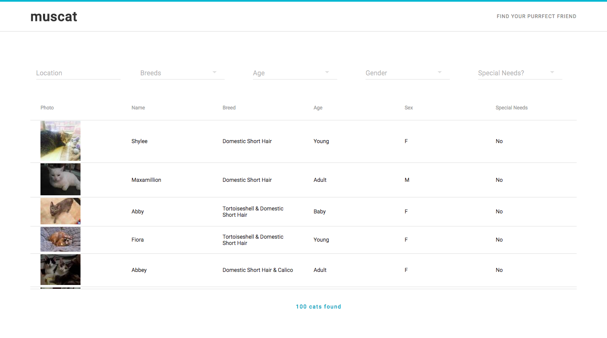
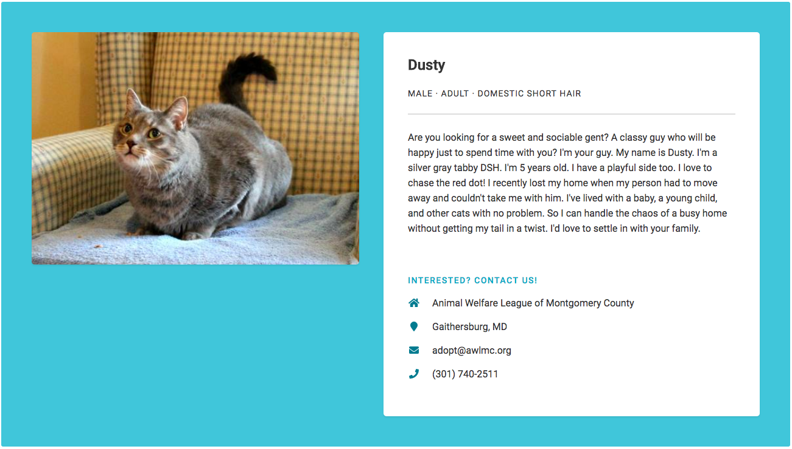

# muscat

[](https://travis-ci.org/sarah-yu/muscat)

Find your purrfect friend with muscat! This app shows you cats that are available for adoption and is named after my own cat, Muscat.

This project has two parts:
1. [RESTful API back end](https://github.com/sarah-yu/muscat-service)
2. React application front end

Unit tests and integration tests can be found in the back end.





With muscat, you can:
- Search for cats by location (zip code or city, state).
- Filter by breed, age, gender, and special needs.
- See more details about each cat, including contact information for those interested in adopting.





## Technology & Data

Data
- [Petfinder API](https://www.petfinder.com/developers/api-docs)

Back End
- [Node.js](https://nodejs.org/en/)
- [Express.js](https://expressjs.com/)

Front End
- [React.js](https://reactjs.org/)
- [Material-UI](http://www.material-ui.com/)

Testing & Continuous Integration
- [Mocha](https://mochajs.org/), [Chai](http://chaijs.com/), [SuperTest](https://github.com/visionmedia/supertest)
- [Travis CI](https://travis-ci.org/)


## Why muscat?

I built muscat because cats are the best, and I think every cat deserves a loving home. I included a column indicating whether or not each cat has special needs because [some people](https://www.youtube.com/watch?v=7WN3ohF104s) specialize in taking in these kinds of cats, and I think the people that have it in their hearts to do so are truly amazing.


## Installation

A. Make sure you have [Node.js](https://nodejs.org/en/) installed.

B. Back End:
  1. Clone the repo for [the back end api](https://github.com/sarah-yu/muscat-service).
  ```
  git clone git@github.com:sarah-yu/muscat-service.git
  ```

  2. Use a Node.js package manager, like [npm](https://www.npmjs.com/), to install dependencies.
  ```
  npm install
  ```

  3. Start the server.
  ```
  node index.js
  ```

C. Front End:
  1. Clone [this](https://github.com/sarah-yu/muscat) repo.
  ```
  git clone git@github.com:sarah-yu/muscat.git
  ```

  2. Install dependencies.
  ```
  npm install
  ```

  3. Start the React app.
  ```
  npm start
  ```
